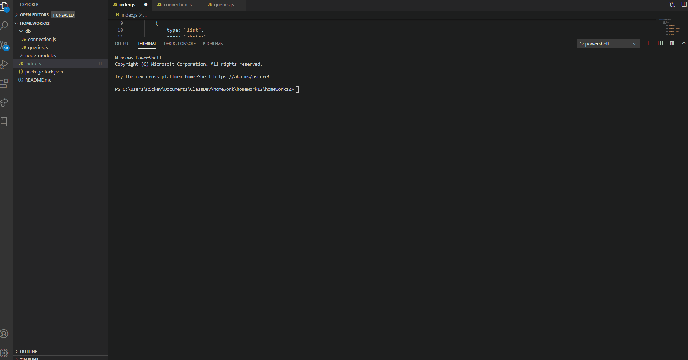

  ## Employee Tracker 
  ## Description

Making it easier to view and manage departments, roles and employees in a company

## Table of Contents 

* [Installation](#installation)

* [Usage](#usage)

* [License](#license)

* [Contributing](#contributing)

* [Tests](#tests)

* [Questions](#questions)

## Installation

Run "npm i" to install dependencies within node.

## Usage

For companies that need to manage their departments, roles and employees

## Questions

If you have any questions contact [AnthonySugrim](https://github.com/AnthonySugrim/homework12) at anthonysugrim16@gmail.com.

 
  